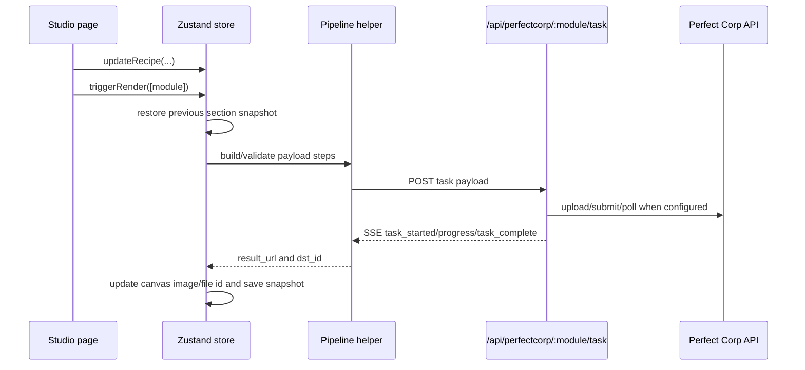

# CharacterForge

CharacterForge is a gamified, crowdsourced character-design and virtual try-on app for cosplay,
theatrical, SFX, and fashion communities. It uses high-fidelity static-image processing rather
than live webcam AR: users upload base photos, compose a character look in the studio, and publish
a reusable **Recipe** that another user can replay against their own photos.

The current app is a Next.js App Router application hosted on Vercel. The homepage (`/`) is the
community dashboard of published recipes, while the creator flow starts at `/studio`.

## Product Flow

1. **Discover** - `/` lists published community recipes. Each card links to
   `/recipes/[recipe_id]`, where the stored recipe can become the entry point for replay.
2. **Upload base photos** - `/studio/upload` collects three required canvases:
   `headshot`, `fullbody`, and `handwrist`. A `feet` canvas type exists in the shared model for
   shoe-oriented modules, but it is not part of the current studio navigation.
3. **Configure modules** - Studio pages update the in-memory recipe:
   wardrobe, accessories, hair, and makeup.
4. **Apply renders** - The user applies a module to run the relevant Perfect Corp task chain.
   Render outputs update the canvas preview and become the input to later module steps.
5. **Publish** - The studio publishes only the portable Recipe JSON. User base photos and rendered
   body/face composites stay out of community storage.

Detailed publishing behavior is documented in
[docs/recipe-publishing.md](docs/recipe-publishing.md).

## Tech Stack

- **Framework:** Next.js 15 App Router, React 19, TypeScript
- **Styling:** Tailwind CSS
- **Client state:** Zustand
- **Image and VTO provider:** Perfect Corp v1/v2 APIs, proxied through Next.js route handlers
- **Storage:** Redis or Upstash Redis REST for recipes, file-id cache, and v1 auth token cache
- **Durable assets:** Vercel Blob for reusable reference assets, with local upload fallback in dev
- **Hosting target:** Vercel

## Route Architecture

### Pages

| Route | Component | Purpose |
| --- | --- | --- |
| `/` | `app/page.tsx` | Server-rendered community dashboard. Calls `listRecipes()` and renders `CommunityDashboard`. |
| `/community` | `app/community/page.tsx` | Legacy redirect to `/`. |
| `/recipes/[recipe_id]` | `app/recipes/[recipe_id]/page.tsx` | Loads a full published recipe with `getRecipe()`. |
| `/community/[recipe_id]` | `app/community/[recipe_id]/page.tsx` | Legacy redirect to `/recipes/[recipe_id]`. |
| `/studio` | `app/studio/page.tsx` | Redirects to `/studio/upload`. |
| `/studio/*` | `app/studio/layout.tsx` + `components/studio/StudioShell.tsx` | Shared wizard shell, progress stepper, navigation, publish action, and canvas preview. |

The active studio steps are:

- `/studio/upload` - base photo upload and canvas validation.
- `/studio/wardrobe` - clothing slot configuration and wardrobe try-on.
- `/studio/accessories` - ring, bracelet, watch, and necklace reference upload and try-on.
- `/studio/hair` - hairstyle template or reference upload, then hair transfer.
- `/studio/makeup` - face-region map, catalog patterns, colors, intensities, and makeup VTO.

### API Routes

| Route | Purpose |
| --- | --- |
| `GET /api/recipes` | Returns community-safe recipe summaries. |
| `POST /api/recipes` | Validates and creates a new published recipe. |
| `GET /api/recipes/[recipe_id]` | Returns a full recipe for detail/replay. |
| `PATCH /api/recipes/[recipe_id]` | Updates recipe title. |
| `DELETE /api/recipes/[recipe_id]` | Deletes a recipe. |
| `POST /api/perfectcorp/[module]/file` | Validates and uploads module files, returning a provider/local `file_id` and sometimes a public URL. |
| `POST /api/perfectcorp/[module]/task` | Runs module-specific Perfect Corp work and streams task events as SSE. |
| `GET /api/perfectcorp/[module]/task/[id]` | Reads local stub task status. |
| `GET /api/perfectcorp/catalog/hair-transfer` | Loads hair transfer templates. |
| `GET /api/perfectcorp/catalog/hair-styles/[module]` | Loads v1 hair catalog data for supported hair modules. |
| `GET /api/styles/[category]` | Loads makeup catalog patterns for a region slug. |
| `POST /api/auth/v1` | Returns a cached Perfect Corp v1 RSA access token. |
| `GET /api/uploads/[fileId]` | Serves local development uploads when Vercel Blob is not configured. |

## Client State Model

All studio state is owned by `useCharacterForgeStore` in `store/characterforge.store.ts`.
It combines the canvas slice and recipe slice:

- `recipe` is the portable character definition. It has `schema_version`, `created_at`,
  `title`, `display_image_url`, `wardrobe`, `makeup`, `hair`, `nails`, and `jewelry`.
- `canvases` tracks render state for `headshot`, `fullbody`, `handwrist`, and `feet`:
  current image URL, current file id, task history, and status.
- `basePhotos` keeps the user's local `File` objects. These are client-only.
- `fileIds` stores uploaded provider/local ids for the base canvases.
- `dirtyModules` records which modules need re-rendering.
- `sectionSnapshots` stores canvas image/file-id snapshots at each studio step so back/forward
  navigation can restore the correct input state.

The store exposes three important orchestration methods:

- `triggerRender(modules)` routes each module name to the right pipeline and updates canvas state.
- `publishRecipe()` prepares and posts the recipe to `/api/recipes`, then redirects to `/`.
- `resetStudio()` returns the studio to a fresh default recipe and empty canvas state.

## Rendering Pipeline

The studio uses the same high-level flow for every module:



Module-specific behavior:

- **Wardrobe** uses `runWardrobePipeline()`. Clothing steps are built from the wardrobe config and
  run sequentially against the `fullbody` canvas. Each successful output becomes the next source.
- **Accessories** uses `runJewelryPipeline()`. Hand accessories run against `handwrist`; necklaces
  run against `headshot`. Outputs chain independently per canvas.
- **Hair** uses `runHairTransfer()`. The selected template or reference upload is converted into
  a v2.1 hair-transfer payload and applied to `headshot`.
- **Makeup** uses `buildMakeupEffects()` and `runMakeupVto()`. Region selections become Perfect
  Corp makeup effects and apply to `headshot`.
- **Nails** has payload and runner support in `lib/nails/*` and `nail-vto` API handling, but there
  is not currently a studio route for nail editing.

When `PERFECTCORP_V2_API_KEY` is absent, task routes return deterministic local stub tasks and
placeholder outputs so the studio remains usable during local development.

## Perfect Corp Proxy Layer

Browser code never calls Perfect Corp directly. It calls internal route handlers that:

1. Validate the requested module against `constants/api-modules.ts`.
2. Validate image type, size, dimensions, and module-specific upload rules.
3. Upload files to Perfect Corp when credentials are present.
4. Resolve locally stored or Blob-backed reference URLs into provider-compatible ids/URLs.
5. Submit and poll v2 tasks or call v1 catalog/auth helpers.
6. Stream progress and completion to the client as server-sent events.

Supported module names include `image-gen`, `makeup-vto`, `nail-vto`, `cloth`, `hat`, `bag`,
`shoes`, `ring`, `bracelet`, `watch`, `necklace`, `hair-transfer`, `hair-style`, `hair-color`,
`hair-ext`, `hair-bang`, and `hair-vol`.

## Storage and Privacy

CharacterForge intentionally separates private user photos from reusable design assets.

### Published Recipes

Recipes are persisted by `lib/recipe/repository.ts` through `RedisCache`:

- Index key: `recipes:index`
- Per-recipe key: `recipe:{recipe_id}`
- Server-assigned id: `recipe_id = randomUUID()`
- Local fallback: `.data/recipes/index.json` plus one JSON document per recipe when Redis is not configured

`GET /api/recipes` returns `RecipeListItem` summaries only. Full module configuration is returned
by `GET /api/recipes/[recipe_id]`.

### Uploads and File Cache

Upload handling lives behind `POST /api/perfectcorp/[module]/file`.

- Base person photos are transient task inputs. They are uploaded to Perfect Corp when needed but
  are not stored as public CharacterForge assets.
- Reusable reference assets, such as jewelry photos, hair references, generated clothing refs, and
  nail designs, may be stored in Vercel Blob and referenced from recipes.
- Redis caches file hashes and provider ids under keys like `file:{module}:{sha256}` and
  `file:url:{file_id}` with short TTLs.
- If `BLOB_READ_WRITE_TOKEN` is not set, local uploads are stored and served by
  `/api/uploads/[fileId]` for development.

## Recipe Schema

The recipe schema is defined in `types/recipe.ts` and validated by `lib/recipe/schema.ts`.
Serialization is intentionally strict:

- `serialiseRecipe()` and `deserialiseRecipe()` both call `validateRecipeSchema()`.
- `prepareRecipeForPublish()` removes any existing client `recipe_id`, sets `schema_version:
  "1.0"`, and validates before posting.
- `extractRecipeForReplay()` returns a full schema-valid `PublishedRecipe`.
- List extraction uses `toRecipeListItems()` to avoid leaking module payloads into the dashboard.

A published recipe stores portable choices, reusable references, and a display picture. The
creator's local base photos are still kept out of recipe storage.

## Validation

Validation happens on both sides of the network boundary:

- Client upload helpers compress images before upload according to the target module canvas.
- Server upload routes enforce MIME checks, dimension/size rules, canvas-specific requirements,
  accessory reference rules, and nail design rules.
- Recipe writes are schema-validated on publish.
- Pipeline builders validate that the required source canvas ids and reference assets exist before
  a task starts.

## Environment

Copy `.env.local.example` to `.env.local`, or use `vercel env pull .env.local`.

```bash
PERFECTCORP_V2_API_KEY=
PERFECTCORP_TEXT_TO_IMAGE_TEMPLATE_ID=
PERFECTCORP_V1_CLIENT_ID=
PERFECTCORP_V1_CLIENT_SECRET=
BLOB_READ_WRITE_TOKEN=
LOCAL_UPLOAD_BASE_URL=http://localhost:3000
KV_REST_REDIS_URL=
UPSTASH_REDIS_REST_URL=
UPSTASH_REDIS_REST_TOKEN=
```

Notes:

- `KV_REST_REDIS_URL` enables a standard Redis connection.
- `UPSTASH_REDIS_REST_URL` and `UPSTASH_REDIS_REST_TOKEN` enable Upstash Redis REST.
- `BLOB_READ_WRITE_TOKEN` enables Vercel Blob for public reusable reference assets.
- Missing Perfect Corp v2 credentials trigger local task stubs for development.

## Development

```bash
npm install
npm run dev
npm run typecheck
```

Use `vercel dev` when testing Vercel-managed environment variables and Blob behavior locally.

