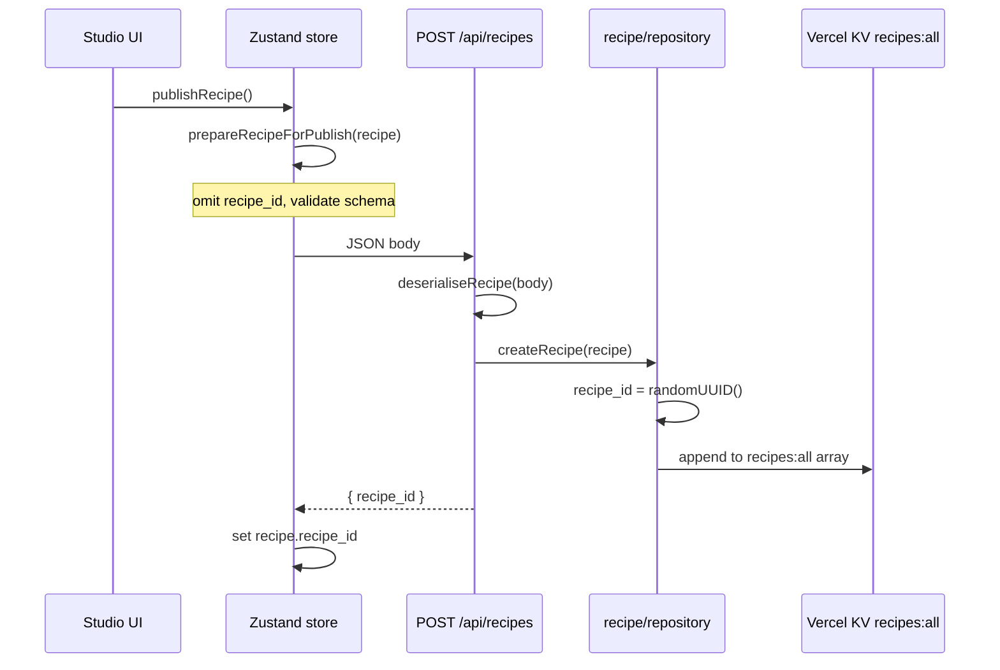

# Recipe publishing

CharacterForge treats a **Recipe** as the portable, shareable definition of a character look. Publishing copies that JSON into community storage; the homepage lists summaries and detail pages load the full document for try-on replay.

## What gets published

| Stored in Recipe (published) | Never stored in Recipe (client-only) |
| --- | --- |
| `wardrobe` — generated garment refs, prompts, slot state | User base photos (`basePhotos` in Zustand) |
| `makeup` — regions, patterns, colors, `api_effects` | Rendered canvas URLs (`canvases.*.current_image_url`) |
| `hair` — transfer template / reference | Perfect Corp `fileIds` for the creator’s uploads |
| `nails` — shapes, colors, custom texture URLs | |
| `jewelry` — ring/bracelet/watch/necklace refs | |

Final four-pane composites that include the creator’s face or body are **not** written to the community index. The grid will eventually use catalog/mannequin thumbnails built from isolated assets in the Recipe (see product README).

## Publish flow (studio → API → storage)

1. **Prepare** — `lib/recipe/publishing.ts` → `prepareRecipeForPublish()` removes any client `recipe_id`, sets `schema_version: "1.0"`, and runs `serialiseRecipe()` / `validateRecipeSchema()`.
2. **POST** — `store/characterforge.store.ts` → `publishRecipe()` posts to `/api/recipes`.
3. **Persist** — `lib/recipe/repository.ts` → `createRecipe()` assigns `recipe_id`, appends to the array at KV key `recipes:all` (in-memory fallback when KV is unset).
4. **Surface** — Homepage (`/`) calls `listRecipes()` and renders `RecipeListItem` rows only.

Re-publishing today always creates a **new** `recipe_id` (no upsert). Updates to title only: `PATCH /api/recipes/:recipe_id`.

## Extraction (storage → UI / replay)

| Consumer | Function / route | Shape returned |
| --- | --- | --- |
| Community homepage | `listRecipes()` → `toRecipeListItems()` | `RecipeListItem[]` — `recipe_id`, `title`, `created_at`, `schema_version` |
| Recipe detail / try-on | `getRecipe(id)` → `extractRecipeForReplay()` | `PublishedRecipe` — full module config |
| HTTP list | `GET /api/recipes` | `{ data: RecipeListItem[], total }` |
| HTTP detail | `GET /api/recipes/:recipe_id` | `{ data: PublishedRecipe }` |

**Community try-on** (future): load `PublishedRecipe` via `GET /api/recipes/:id`, upload the viewer’s base photos, run the same pipeline helpers as the studio (`runMakeupVto`, `runWardrobePipeline`, etc.) with the stored parameters unchanged.

## Storage layout

- **Key:** `recipes:all` in Vercel KV (`lib/storage/kv.ts` → `KvCache.listRecipes` / `saveRecipes`).
- **Value:** JSON array of `PublishedRecipe` objects (newest-first when listed).
- **Validation:** inbound writes use `deserialiseRecipe()`; outbound replay uses `extractRecipeForReplay()` so reads stay schema-valid.

## Routes

| Path | Role |
| --- | --- |
| `/` | Community dashboard (homepage) |
| `/community` | Redirects to `/` |
| `/recipes/:recipe_id` | Published recipe detail / try-on entry |
| `/community/:recipe_id` | Redirects to `/recipes/:recipe_id` |
| `/studio` | Creator flow (publish control lives in studio modules) |
