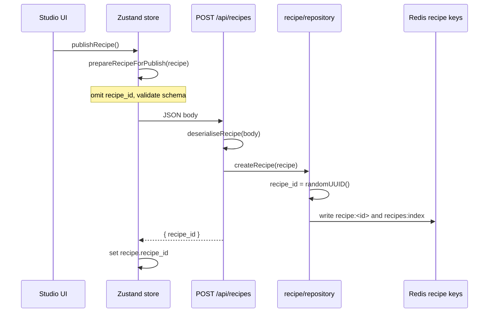

# Recipe publishing

CharacterForge treats a **Recipe** as the portable, shareable definition of a character look. Publishing copies that JSON into community storage; the homepage lists summaries and detail pages load the full document for try-on replay.

## What gets published

| Stored in Recipe (published) | Never stored in Recipe (client-only) |
| --- | --- |
| `title` and `display_image_url` | User base photos (`basePhotos` in Zustand) |
| `wardrobe` — generated garment refs, prompts, slot state | |
| `makeup` — regions, patterns, colors, `api_effects` | |
| `hair` — transfer template / reference | Perfect Corp `fileIds` for the creator’s uploads |
| `nails` — shapes, colors, custom texture URLs | |
| `jewelry` — ring/bracelet/watch/necklace refs | |

The display picture is saved as the recipe cover for community browsing. Other creator base photos
remain client-only and are not written to the community index.

Upload storage follows the same privacy split: standalone reference assets (clothes, rings, watches, hair references, nail textures) may be stored in Blob and referenced from the Recipe; base person photos are transient API inputs and are not durable CharacterForge storage.

## Publish flow (studio → API → storage)

1. **Prepare** — `lib/recipe/publishing.ts` → `prepareRecipeForPublish()` removes any client `recipe_id`, sets `schema_version: "1.0"`, and runs `serialiseRecipe()` / `validateRecipeSchema()`.
2. **POST** — `store/characterforge.store.ts` → `publishRecipe()` posts to `/api/recipes`.
3. **Persist** — `lib/recipe/repository.ts` → `createRecipe()` assigns `recipe_id`, writes the full document to `recipe:{recipe_id}`, and updates `recipes:index` (with `.data/recipes/*` fallback when Redis is unset locally).
4. **Surface** — Homepage (`/`) calls `listRecipes()` and renders `RecipeListItem` rows only.

Re-publishing today always creates a **new** `recipe_id` (no upsert). Updates to title only: `PATCH /api/recipes/:recipe_id`.

## Extraction (storage → UI / replay)

| Consumer | Function / route | Shape returned |
| --- | --- | --- |
| Community homepage | `listRecipes()` → `toRecipeListItems()` | `RecipeListItem[]` — `recipe_id`, `title`, `display_image_url`, `created_at`, `schema_version` |
| Recipe detail / try-on | `getRecipe(id)` → `extractRecipeForReplay()` | `PublishedRecipe` — full module config |
| HTTP list | `GET /api/recipes` | `{ data: RecipeListItem[], total }` |
| HTTP detail | `GET /api/recipes/:recipe_id` | `{ data: PublishedRecipe }` |

**Community try-on** (future): load `PublishedRecipe` via `GET /api/recipes/:id`, upload the viewer’s base photos, run the same pipeline helpers as the studio (`runMakeupVto`, `runWardrobePipeline`, etc.) with the stored parameters unchanged.

## Storage layout

- **Index key:** `recipes:index` in Redis (`lib/storage/redis.ts` → `RedisCache.listRecipes` / `saveRecipes`).
- **Recipe key:** `recipe:{recipe_id}` for each full `PublishedRecipe` document.
- **Local fallback:** `.data/recipes/index.json` plus `.data/recipes/{recipe_id}.json`.
- **Validation:** inbound writes use `deserialiseRecipe()`; outbound replay uses `extractRecipeForReplay()` so reads stay schema-valid.
- **Config:** set `KV_REST_REDIS_URL` for a standard Redis connection, or `UPSTASH_REDIS_REST_URL` and `UPSTASH_REDIS_REST_TOKEN` for Upstash Redis REST.

## Routes

| Path | Role |
| --- | --- |
| `/` | Community dashboard (homepage) |
| `/community` | Redirects to `/` |
| `/recipes/:recipe_id` | Published recipe detail / try-on entry |
| `/community/:recipe_id` | Redirects to `/recipes/:recipe_id` |
| `/studio` | Creator flow (publish control lives in studio modules) |
